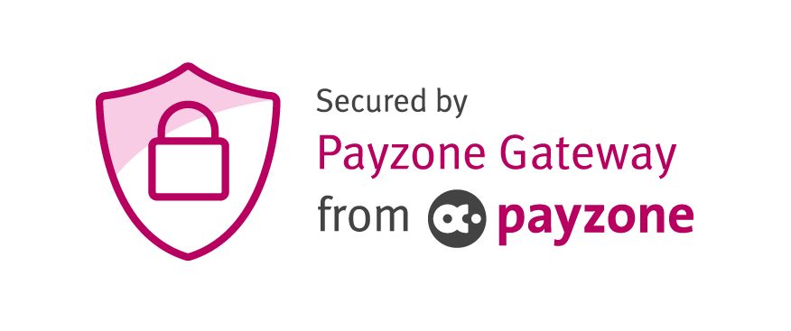

# PayZone Payment Gateway for bespoke PHP integration

## Release 1.3.4 - 16th August 2018

###  Changed
* Message for save quote function

## Release 1.3.3 - 8th January 2018

###  Changed
* Handling for quotes inside the form variables

## Release 1.3.2 - 26th September

### Added
* Refund page and processing
* Cross reference variable option

### Changed
* Cross Reference transaction handling process

## Release 1.2.2- 14th September

### Changed
* Fixed issue with IE not supporting FormData objects
* Fixed bug with CrossReference check not always being picked up

## Release 1.2.1- 6th September

### Changed
* Added in CrossReference transaction functionality / repeat transactions
* Amended validation check function to change target for cross reference transactions

## Release 1.2.0- 19th June

### Changed
* Focus to Direct only - removed Transparent & Hosted files

## Release 1.1.0 - 24th May

### Added
* Class and function descriptors
* Namespaces functions and classes
* Transparent redirect end to end functionality
* DEVELOPER NOTES for key sections
* Version check API connection

### Changed
* Tweaked code layout to be easier to read
* Fixed issue with extra space padding in transaction time stamp
* Updated README.md
* Split out and updated payzone_scripts.php to reference and load scripts via .js files
* Refined payzone_validate.js functions
* Configuration page wording

---

## Release 1.0.6 - 22nd May

### Added
* Transparent Redirect standard payment added
* Transparent redirect 3D secure handling
* 3D Secure hash validations
* Transparent redirect form / input validation

### Changed
* Moved demo data class to index.php file
* ISO Currencies  to load symbols

---

## Release 1.0.5 - 19th May

### Added
* Added direct access exit functions to block direct access to PHP files
* Input masking and formatting for Card Number & CV2 Fields and validation
* CV2/CVV tooltip image

### Changed
* IPAddress inclusion in Direct API payment object set to null to avoid issue with IPV6 addresses rejected due to invalid format
* Demo data generates random strings rather than static as required
* DB Example includes major, minor and formatted currencies
* Date Time response for Server_Pull responses
* Changed static demo data calls from deprecated public functions to static

---

## Release 1.0.4 - 18th May

### Added
* Notes for construct() function
* Added debug steps to pass stop automated submission and log the information to console for POST & GET
* Form submission validations ensure all variables received
* Debug Mode notification on all pages

### Changed
* URL loading and structure
* Removed the log to file functions
* Default data loaded into the index.php rather than cart & payment files - content passed through via POST for validation purposes.
* Added validation for ISO Code or Short Code to Country dropdown pre selected (from $POST data)

---

## Release 1.0.3 - 17th May

### Added
* Card details form entry
* Direct API handling Added
* Direct API 3D processing added
* Hash functions added for Direct API
* Direct API XHR functions

### Changed
* Payment.php data handling
* Direct API card details moved to payments section from cart
* DBExample logging moved from response validation to processing
* DBExample logging added validation using SQL data and removed cookie dependency
* File structure and require / includes

---

## Release 1.0.2 - 12th May

### Added
* README and Change Logs
* Iframe handling functionality
* Demo data inclusion
* Debug logging class / function
* Configuration options (hide images, display forms / details etc)
* Result logic handling (error success and failure)
* Example result / transaction DB logging functionality
* Landing / information page and configuration details
* Developer notes added (partial)

### Changed
* Fixed issue with JCB cards presenting a Hash Validation Rejection error due to intval setting a null as a 0.
* iFrame close behaviour, redirection on close and result handling
* Results object - details information to include order details and payment details

---

## Release 1.0.1 - 5th May 2017

### Added
* Default customer details form added
* Hosted Payment Forms Method
* Server Pull result Method
* Post result Method
* index -> cart -> payment -> results structure
* Loading sequence
* iFrame cross window messaging set up
* Logo / images / branding
* Demo CSS file - and styling for results and transaction / details
* ISO Country / Currency / Date drop downs and auto population
* Gateway files and classes
* Helpers files and classes, pem etc

---

## Release 1.0
* Initial version launched.

