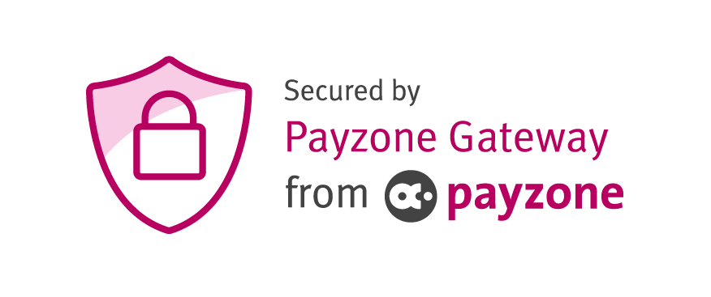

# PayZone Payment Gateway bespoke php integration

#### Version 1.3.4

## Getting Started

This PHP integration pack will allow you to implement the payzone payment gateway into your site, using the preferred method for integration.

As part of the integration pack, you will of also received the below documents:
* Getting started pack - non technical overview, to help decide on the best integration method
* Detailed overviews - technical overview of each integration method - useful for customising the integrations
* Test card details pack - document detailing the test card details that can be used with the test accounts

This module is designed to be flexible to connect with your e-commerce / payment system as required - please follow the steps below to install, configure and test this module.

## Installation & Setup

To install the payment gateway:

  1. Upload the files to the server via FTP</li>
  2. In the assets/includes/payzone_gateway.php file, inside the construct() function update the set statements with your merchant details</li>
    * Merchant ID - this can be found in the <a href="https://mms.payzoneonlinepayments.com/Login.aspx">MMS</a> under Account Admin -> Gateway Account Admin
    * Merchant Password - this can be reset in the <a href="https://mms.payzoneonlinepayments.com/Login.aspx">MMS</a> under Account Admin -> Gateway Account Admin
    * Pre Shared Key - this can be found in the <a href="https://mms.payzoneonlinepayments.com/Login.aspx">MMS</a> under Account Admin -> Account Settings
    * Secret Key - This is a unique string for use by the site, you can create any random string
    * Hash method - this can be found in the <a href="https://mms.payzoneonlinepayments.com/Login.aspx">MMS</a> under Account Admin -> Account Settings
    * Integration Type - this depends on your configuration and which option is best suited to meet your needs
  3. Click on one of the Submit options below, depending on whether you want to submit with dummy data, or manually enter test details
  4. Once you have successfully tested you can start integrating with your system, recording the transaction into your transaction log, and getting / setting the configuration values using your sites database

## Authors

* **PayVector** - *Initial work* - [PayVector](http://www.payvector.co.uk/)
* **Keith Rigby** - *PayZone Development* - [keithrigby.co.uk](https://keithrigby.co.uk/)

